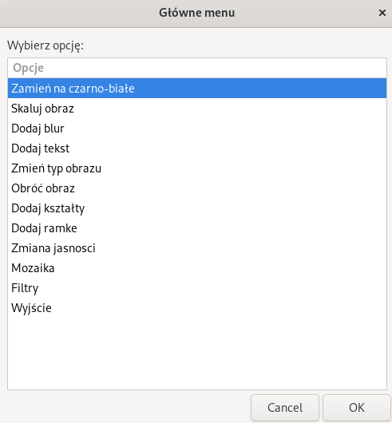

# Description
BashPhoto Editor is a versatile image editing tool written in Bash, leveraging the power of `ImageMagick` for image manipulation and `Zenity` for GUI dialogs. This script allows users to perform a variety of image editing operations, making it a handy tool for quick and efficient image modifications.

    

## Features
- **Convert to Black and White**: Transform images to grayscale.
- **Image Scaling**: Resize images to specified dimensions.
- **Add Blur**: Apply a blur effect with customizable radius.
- **Text Overlay**: Add custom text to images with options for font, size, color, and position.
- **Format Conversion**: Change image format between PNG, JPEG, and GIF.
- **Image Rotation**: Rotate images by a specified degree.
- **Shape Insertion**: Insert shapes like rectangles, circles, lines, and triangles into images.
- **Frame Addition**: Add simple or decorative frames around images.
- **Brightness Adjustment**: Modify the brightness of images.
- **Mosaic Effect**: Apply a mosaic effect to images.
- **Artistic Filters**: Add artistic filters such as sketch and oil paint effects.
